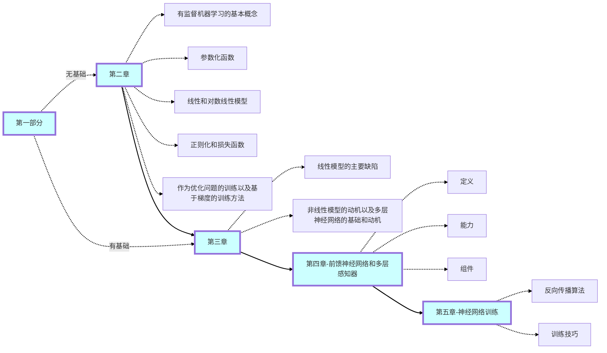

# 引言
  
## 自然语言处理的挑战
  
- 歧义
- 多样输入
- 离散性
- 组合性
- 数据稀疏性

## 神经网络和深度学习

学习参数可微的数学函数  
不仅是预测，也用来建立非结构化数据和结构化的标签之间的映射关系

## 自然语言处理中的深度学习

嵌入层：将符号映射为向量

- 前馈网络 MLP
- 卷积前馈网络 CNN
- 循环神经网络 RNN

## 本书覆盖面和组织结构

本书包含四大部分：

- 一、学习机制，ch2-5
- 二、机制与语言关联，ch6-12
- 三、特殊的卷积和循环结构，ch13-17
- 四、最新进展，ch18-20

ps,部分章节可以跳过

## 本书未覆盖的内容

- 部分子领域
- 重要基础，如恰当评价和数据标注

## 术语

- 特征（featur）
- 输人向量（input vector）
- 输入向量条目（input vector entry）

## 数学符号