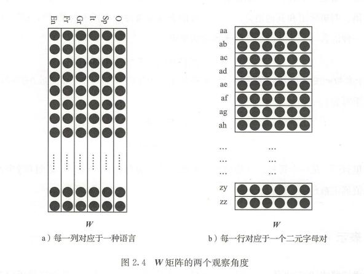

# 第二章 学习基础与线性模型

推荐阅读：Daume III[2015]、 Shalev Shwartz 和 Ben-David[2014]和 Mohri 等人[2012]。

<!-- TOC -->

- [第二章 学习基础与线性模型](#第二章-学习基础与线性模型)
- [1. 有监督学习和参数化函数](#1-有监督学习和参数化函数)
- [2. 训练集、测试集和验证集](#2-训练集测试集和验证集)
- [3. 线性模型](#3-线性模型)
    - [3.1. 二分类](#31-二分类)
    - [3.2. 对数线性二分类](#32-对数线性二分类)
    - [3.3. 多分类](#33-多分类)
- [4. 表示](#4-表示)
- [5. 独热和稠密向量表示](#5-独热和稠密向量表示)
- [6. 对数线性多分类](#6-对数线性多分类)
- [7. 训练和最优化](#7-训练和最优化)
    - [7.1. 损失函数](#71-损失函数)
    - [7.2. 正则化](#72-正则化)
- [8. 基于梯度的最优化](#8-基于梯度的最优化)
    - [8.1. 随机梯度下降](#81-随机梯度下降)
    - [8.2. 实例](#82-实例)
    - [8.3. 其他训练方法](#83-其他训练方法)

<!-- /TOC -->

# 1. 有监督学习和参数化函数

- 函数簇————假设类
因为搜索所有可能的程序（或函数）是非常困难（和极其不明确）的问题，通常把函数限制在特定的函数簇内，比如所有的具有$d_{in}$个输入、$d_{out}$个输出的线性函数所组成的函数空间，或者所有包含$d_{in}$个变量的决策树空间 。  
 
- 归纳偏置
一组关于期望结果形式的假设，同时也使得搜索结果的过程更加高效
 
- 常见的假设类——高维线形函数

$$f(x)=x \cdot W+b
\\x \in R^{d_{in}} \quad W \in R^{d_{in}\times d_{out}} \quad b \in d_{out}$$

# 2. 训练集、测试集和验证集

- 留一法
  - 只适用小数据集
- 留存集
  - 训练集+留存集
  - 不一定需要随机划分，不一定需要保证两个集合均匀，例：时序预测
- 三路划分
  - 适用于训练多个模型
  - 训练集+验证集+测试集
所有的实验、调参、误差分析和模型选择都应该在验证集上进行，保证测试集尽可能纯洁。

# 3. 线性模型

## 3.1. 二分类

二分类问题中，只有一个输出，可以用以下公式表示
$$f(\bm x)=\bm x \cdot \bm w + b$$
其中，线性函数的值域为$[-\infty,+\infty]$。通常会通过sign函数把$f(\bm x)$映射为-1（负类）和+1（正类）。

- 有时会遇到非线性可分的问题：
  - 转换到高维空间（引入更多特征）
  - 转换到更丰富的假设类
  - 允许误差类存在

## 3.2. 对数线性二分类

有时不仅仅关心类别，也会关心决策的置信度，以及分类器如何分配类别。此时经过扁平函数将其映射到[0,1]范围中，如$\sigma(x)=\frac{1}{1+e^{-x}}$

函数可以理解为对于正类1的概率估计，估计值越接近0或1，表明预测越确定。

## 3.3. 多分类

例如，给定一个文档，要求把它分类到 6 种不同语言中的一个：英语、法语、德语、意大利语、西班牙语和其他语言。一个可能的方法是考虑 6 个权重向量$w^{EN}$，$w^{FR}$，…以及偏置，一种语言一个，并以最高分来预测结果语言：
$\hat y= f(\bm x)= \argmax_{L \in \{EN,FR,GR,IT,SP,O\}} \bm {x \cdot w^L}+b^L$

将 6 组$\bm w$和$b$合并成矩阵$\bm W$和向量$\bm b$，得到公式
$$\bm {\hat y} =f(\bm x)=\bm {x \cdot W}+\bm b
\\prediction=\hat y =\argmax_i \bm{\hat y_{[i]}}$$

# 4. 表示

上一节中的向量$\bm {\hat y}$可以被认为是该文档的一个**表示**。

标准化的向量$\bm x$也可以认为是文档的表示，但不如$\bm {\hat y}$紧凑，可能包含多余信息，如文档主题。

矩阵$\bm W$可以认为包含已学得的表示，其中每一列是字符对语言的向量表示，每一行表示二元字母对关于语言的六维向量表示。

在线性情况下，可以为表示向量的每一维指派一个有意义的解释。但通常其只具有预测能力但没有解释能力。

# 5. 独热和稠密向量表示

在语言分类的例子中，输入向量包含了在文档$D$中已标准化的二元对数量。这个向量可以被分解为$|D|$个向量，每一个对应于一个特定的文档位置$i$:
$$x=\frac{1}{|D|}\sum_{i=1}^{|D|} x^{D_{[i]}}$$
其中，$D_{[i]}$是在文档位置$i$上的二元对，每个向量$x^{D_{[i]}}\in R$是一个独热（one-hot）向量，在这个向量中除了对应于二元字母对$D_{[i]}$的分量是 1 ，其余分量均为 0 。例，$x=[0,1,0,...,0]$

结果向量$x$常被称作**平均二元对词袋**(aver­aged  bag of word, 或 bag of  words )。Bag-Of-Words （BOW）表示包含文档中所有单词（在这里是二元对）的不考虑次序的个性信息。一个独热表示可以被认为是一个单一单词的词袋 。

类似的，可以用系数矩阵$\bm W$替代文档表示向量$\hat y$。$\bm W^{D_{[i]}}$表示$\bm W$中对应于二元对$D_{[i]}$的那一行：
$$\hat y=\frac{1}{|D|}\sum_{i=1}^{|D|} \bm W^{D_{[i]}}$$
这种表示通常被称作连续单词词袋（Continuous Bag Of Words,  CBOW），它由低维度连续向量的单词表示的总和组成。

推导：
$$
\bm y=\bm{x \cdot W}
\\=(\frac{1}{|D|}\sum_{i=1}^{|D|} \bm x^{D_{[i]}})\cdot \bm W
\\=\frac{1}{|D|}\sum_{i=1}^{|D|} (\bm x^{D_{[i]}} \cdot \bm W)
\\=\frac{1}{|D|}\sum_{i=1}^{|D|} \bm W^{D_{[i]}}
$$
换句话说， CBOW 表示可以通过求单词表示向量和或者通过将一个单词词袋向量乘以一个每一行对应于一个稠密单词表示的矩阵（这样的矩阵也叫作**嵌入矩阵**（ embedding matricy ））来得到。

# 6. 对数线性多分类

在二分类情况中，我们利用 sigmoid 函数把线性预测转变为一个概率估计，从而得到了一个对数线性模型。在多分类情况中是把分数向量通过一个 softmax 函数 ：
$$softmax(x)_{[i]}=\frac{e^{x_{[i]}}}{\sum_j e^{x_{[j]}}}$$
得到 ：
$$
\bm {\hat y}=softmax(\bm{xW+b})
\\\hat \bm y_{[i]}=\frac{e^{(\bm{xW+b})_{[i]}}}{\sum_j e^{(\bm{xW+b})_{[j]}}}
$$
softmax 转换强制$\hat \bm y$中的值为正数，和为1，使得它们可以被认为是一个概率分布。

# 7. 训练和最优化

输入向量$\bm x_{1:n}$，输出向量$\bm y_{1:n}$。
引入**损失函数**（loss function）的概念，衡量当预测是$\hat \bm y$而正确标签是$\bm y$时所遭受的损失。形式上，给定正确的期望输出$y$，损失函数$L(\hat \bm y,\bm y)$指派一个数值分数（标量）给预测输出$\hat \bm y$。损失函数是有下界的，预测正确时取得最小值。

$$\hat \Theta=\argmin_\Theta \mathcal L(\Theta)=\argmin_\Theta \frac{1}{n}\sum_{i=1}^n L(f(\bm x_i; \Theta),\bm y_i)$$

为避免**过拟合**，引入**正则项**$R$进行软约束
$$\hat \Theta=\min_\Theta \frac{1}{n}\sum_{i=1}^n L(f(\bm x_i; \Theta),\bm y_i)+\lambda R(\Theta)$$
损失函数和正则标准的不同组合会致使不同的学习算法，具有不同的归纳偏置 。

## 7.1. 损失函数

常用的损失函数：

**hinge（二分类）** hinge 损失亦称为间隔损失（margin loss）或者支持向量机（SVM）损失，被定义为：
$$L_{hinge(binary)}(\tilde y,y)=max(0,1-y \cdot \tilde y)$$
当$y$和$\tilde y$同号，并且$|\tilde y|\ge 1$时，损失为0

**hinge（多分类）** 令$\bm{\hat y= \hat y_{[1]},\hat y_{[2]},...,\hat y_{[n]}}$为分类器的输出向量，$\bm y$为正确输出类别的独热向量。
分类规则被定义为选择分数最高的那个类别：
$$prediction =  \argmax_i \hat \bm y_{[i]}$$
令$t$代表正确类别，$k$代表最高分数类别，且$t \ne k$。多分类 hinge 损失被定义为：
$$L_{hinge(binary)}(\hat \bm y,\bm y)=max(0,1-(\hat \bm y_{[t]}-\hat \bm y_{[k]}))$$
多分类 hinge 损失试图使正确类别的得分比其他类别至少高出1。

**对数（log）损失** 可以看作 hinge 损失的平缓版
本：
$$L_{log}(\hat \bm y,\bm y)=log(1+exp(-(\hat \bm y_{[t]}-\hat \bm y_{[k]})))$$

**二元交叉熵** 二元交叉熵损失也叫作**逻辑斯蒂**（logistic）损失，假设目标类别为0，1。预测规则是：
$$
prediction=\left\{
\begin{aligned}
0 && \hat y<0.5\\
1 && \hat y \ge 0.5
\end{aligned}
\right.
$$
为最大化对数条件概率$\log P(y=1|x)$，逻辑斯蒂损失被定义为：
$$L_{logistic}(\hat y,y)=-ylog\hat y-(1-y)log(1-\hat y)$$

**分类交叉熵（ categorical cross-entropy ） 损失** 当希望得分为概率时，使用分类交叉熵损失（也称作负对数似然， negative log likelihood ）。
针对[2.6节](#6-对数线性多分类)提到的类别条件$\hat \bm y_{[i]}=P(y=i|x)$，分类交叉熵损失度量正确标签分布$\bm y$与预测标签分布$\hat \bm y$之间的相异度。
$$L_{cross-entropy}(\hat \bm y,\bm y)=-\sum_i \bm y_{[i]} \log(\hat \bm y_{[i]})$$
交叉熵损失常见于对数线性模型和神经网络文献中。

**等级损失** 假设没有标签，只有一对正确项$\bm x$和不正确项$\bm x'$。
$$L_{ranking(margin)}(\bm x, \bm x')=\max(0,1-(f(\bm x)-f(\bm x')))$$
其中，$f(\bm x)$是被分类器指派到输入向量$\bm x$上的分数。 目标是去给正确输入打分（分等级），使得分数比错误输入高至少 1 分的间隔。
一个常见的变形是使用等级损失的对数版本：
$$L_{ranking(margin)}(\bm x, \bm x')=\log(1+\exp(-(f(\bm x)-f(\bm x'))))$$

## 7.2. 正则化

- **目的**：避免过拟合

$$\hat \Theta= \argmin_\Theta \mathcal L(\Theta)+\lambda R(\Theta)
\\=\argmin_\Theta \frac{1}{n}\sum_{i=1}^n L(f(\bm x_i; \Theta),\bm y_i)+\lambda R(\Theta)$$

- **基本思想**：得出参数值的复杂度，寻找既是低损失又是低复杂度的参数值

- 正则化器R度量了参数矩阵的范数，使学习器偏向具有低范数的解决方案。R的**常用选择**有$L_2$范数、$L_1$范数和弹性网络（elastic-net）。

  - **$L_2$正则化**：倾向于惩罚高权重的参数
  $$R_{L_2}(\bm W)=||\bm W||_2^2=\sum_{i.j}(\bm W_{[i,j]})^2$$

  - **$L_1$正则化**：倾向于将所有非零参数减少到0
  $$R_{L_1}(\bm W)=||\bm W||_1=\sum_{i.j}|\bm W_{[i,j]}|$$

  - **弹性网络**：
  $$R_{(elastic-net)}(\bm W)=\lambda_1R_{L_1}(\bm W)+\lambda_2R_{L_2}(\bm W)$$

  - **Dropout**：神经网络中常用

# 8. 基于梯度的最优化

- 思路：基于梯度的方法通过反复地计算训练集上的损失$L$的估计和参数$\Theta$关于损失估计的梯度值，并将参数值向与梯度相反的方向调整。

- 基于梯度的最优化动机
二阶导数$f''(x)=0$在多变量函数中很难求解，一个代替的方法是猜测一个$x_i$，然后用一阶导进行递归
$x_{i+1}=x_i-\eta f'(x_i)$
（函数非凸时，只能得到局部最优解）

- 凸性
凸函数有最小值，凹函数有最大值，非凸、非凹函数在使用基于梯度的最优化步骤中可能会汇聚到局部极值点。

## 8.1. 随机梯度下降

## 8.2. 实例

## 8.3. 其他训练方法
